# Class Diagram — Student Course Registration & Fee Management System

```mermaid
classDiagram
    direction TB

    %% ╔══════════════════════════════╗
    %% ║        MODEL LAYER           ║
    %% ╚══════════════════════════════╝

    class Student {
        <<model>>
        -int id
        -String name
        -int age
        -String branch
        +Student(id, name, age, branch)
        +getId() int
        +getName() String
        +getAge() int
        +getBranch() String
        +setName(String) void
        +setBranch(String) void
        +toString() String
    }

    class Registration {
        <<model>>
        -int regId
        -int studentId
        -String courseName
        -double feesPaid
        +Registration(regId, studentId, courseName, feesPaid)
        +getRegId() int
        +getStudentId() int
        +getCourseName() String
        +getFeesPaid() double
        +toString() String
    }

    %% ╔══════════════════════════════╗
    %% ║         UTIL LAYER           ║
    %% ╚══════════════════════════════╝

    class DBUtil {
        <<utility>>
        -String URL
        -String USER
        -String PASSWORD
        +getConnection()$ Connection
    }

    %% ╔══════════════════════════════╗
    %% ║          DAO LAYER           ║
    %% ╚══════════════════════════════╝

    class StudentDAO {
        <<dao>>
        +addStudent(Connection, Student) void
        +getStudentById(Connection, int) Student
        +updateStudent(Connection, int, String, String) void
        +deleteStudent(Connection, int) void
        +getAllStudentsWithRegistrations(Connection) List
    }

    class RegistrationDAO {
        <<dao>>
        +isDuplicateRegistration(Connection, int, String) boolean
        +addRegistration(Connection, Registration) void
        +getRegistrationsByStudentId(Connection, int) List
        +updateFee(Connection, int, String, double) boolean
        +cancelRegistration(Connection, int, String) boolean
        +deleteAllByStudentId(Connection, int) void
        +getHighPayingStudents(Connection, double) List
        +getCourseWiseCount(Connection) List
    }

    %% ╔══════════════════════════════╗
    %% ║       EXCEPTION LAYER        ║
    %% ╚══════════════════════════════╝

    class AppException {
        <<abstract>>
        AppException is the label for java.lang.Exception
    }

    class InvalidInputException {
        <<exception>>
        +InvalidInputException(String)
    }

    class StudentNotFoundException {
        <<exception>>
        +StudentNotFoundException(int)
        +StudentNotFoundException(String)
    }

    class DuplicateStudentException {
        <<exception>>
        +DuplicateStudentException(int)
        +DuplicateStudentException(String)
    }

    class DuplicateRegistrationException {
        <<exception>>
        +DuplicateRegistrationException(int, String)
        +DuplicateRegistrationException(String)
    }

    class RegistrationNotFoundException {
        <<exception>>
        +RegistrationNotFoundException(int, String)
        +RegistrationNotFoundException(String)
    }

    class DatabaseException {
        <<exception>>
        +DatabaseException(String, Throwable)
        +DatabaseException(String)
    }

    %% ╔══════════════════════════════╗
    %% ║       SERVICE LAYER          ║
    %% ╚══════════════════════════════╝

    class StudentService {
        <<service>>
        -StudentDAO studentDAO
        -RegistrationDAO registrationDAO
        +addStudent(int, String, int, String) void
        +registerForCourse(int, String, double) void
        +viewAllStudentsWithCourses() void
        +searchStudentById(int) void
        +updateStudent(int, String, String) void
        +updateCourseFee(int, String, double) void
        +cancelRegistration(int, String) void
        +deleteStudent(int) void
        +getHighPayingStudents(double) void
        +getCourseWiseStudentCount() void
    }

    %% ╔══════════════════════════════╗
    %% ║          UI LAYER            ║
    %% ╚══════════════════════════════╝

    class MainApp {
        <<ui>>
        -StudentService service
        -Scanner sc
        +main(String[])$ void
        -handleChoice(int) void
        -printMenu()$ void
        -readInt()$ int
        -readDouble()$ double
    }

    %% ═══════════════════════════════════════
    %% RELATIONSHIPS
    %% ═══════════════════════════════════════

    %% Exception Inheritance
    InvalidInputException          --|> AppException
    StudentNotFoundException        --|> AppException
    DuplicateStudentException       --|> AppException
    DuplicateRegistrationException  --|> AppException
    RegistrationNotFoundException   --|> AppException
    DatabaseException               --|> AppException

    %% Service owns DAOs (composition)
    StudentService *-- StudentDAO
    StudentService *-- RegistrationDAO

    %% UI depends on Service
    MainApp --> StudentService

    %% Service depends on DBUtil
    StudentService --> DBUtil

    %% DAOs produce/consume models
    StudentDAO    ..> Student      : creates
    RegistrationDAO ..> Registration : creates

    %% Service throws custom exceptions
    StudentService ..> InvalidInputException          : throws
    StudentService ..> StudentNotFoundException        : throws
    StudentService ..> DuplicateStudentException       : throws
    StudentService ..> DuplicateRegistrationException  : throws
    StudentService ..> RegistrationNotFoundException   : throws
    StudentService ..> DatabaseException               : throws
```

---

## Legend

| Notation | Meaning |
|---|---|
| `--|>` | Inheritance (extends) |
| `*--` | Composition (owns) |
| `-->` | Dependency (uses) |
| `..>` | Dashed dependency (throws / creates) |
| `$` after method | Static method |
| `<<stereotype>>` | Layer/role label |
